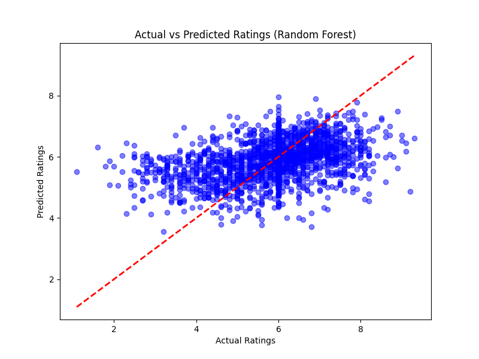
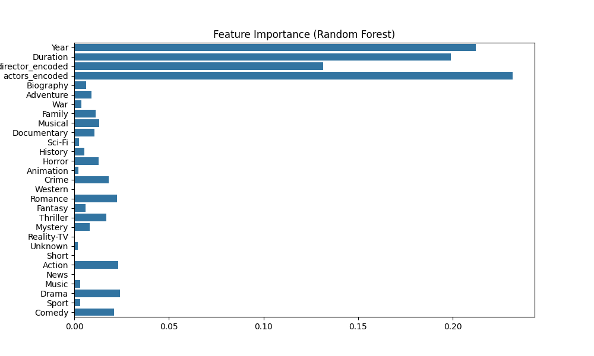

# Movie Rating Prediction using Regression Techniques in Python

## Project Overview
This project develops a regression model to predict movie ratings for Indian films based on features such as genre, director, lead actors, runtime, and release year. The goal is to identify patterns that influence movie ratings and build a predictive model for user ratings.

## Dataset
- **Source**: [IMDb Movies India Dataset](https://www.kaggle.com/datasets/ad1318/imdb-movies-india-dataset)
- **Features**: Genre, Duration, Year, Director, Actor 1, Actor 2, Actor 3
- **Target**: Rating (1–10 scale)
- **Size**: ~15,000 movies

## Folder Structure
- `data/`: Raw dataset (`IMDb Movies India.csv`)
- `notebooks/`: Jupyter notebook for exploratory data analysis (`eda.ipynb`)
- `src/`: Python scripts for preprocessing, model training, and evaluation
- `images/`: Visualizations (e.g., actual vs predicted ratings, feature importance)
- `models/`: Trained models (`linear_regression.pkl`, `random_forest.pkl`)
- `main.py`: Main script to run the pipeline
- `requirements.txt`: List of dependencies

## Installation
1. Clone the repository:
   ```bash
   git clone https://github.com/your-username/movie_rating_prediction.git
   cd movie_rating_prediction

   Create and activate a virtual environment:
python -m venv venv
.\venv\Scripts\activate  # On Windows
Install dependencies:
pip install -r requirements.txt
Run the main script:
python main.py
Usage
Run notebooks/eda.ipynb for exploratory data analysis (if available).
Execute main.py to preprocess data, train models, evaluate performance, and generate visualizations:
python main.py
View evaluation metrics in the terminal and plots in the images/ folder.
Models
Linear Regression: Baseline model for rating prediction.
Random Forest Regressor: Advanced model to capture non-linear relationships.
Evaluation Metrics: Mean Absolute Error (MAE), Root Mean Squared Error (RMSE), R² Score.
Results
The Random Forest Regressor achieved a Test R² of 0.1206, indicating limited generalization due to overfitting (Train R²: 0.8770).
Linear Regression performed poorly with a Test R² of 0.0879, suggesting it’s not suitable for this dataset.
Key predictors include director frequency and runtime (see images/feature_importance.png).
Test MAE (~0.58) and RMSE (~0.92) indicate predictions are off by about 0.6–0.9 points on the 1–10 scale.
Visualizations
Actual vs Predicted Ratings: images/actual_vs_predicted.png
Feature Importance: images/feature_importance.png
Future Improvements
Perform hyperparameter tuning for Random Forest to reduce overfitting.
Incorporate additional features like number of votes or movie budget.
Experiment with advanced models like XGBoost or Gradient Boosting.
Drop rows with missing ratings instead of imputing to improve data quality.
License
MIT License

Contact
GitHub: Vidula-Hub
Email: [vidulasri.s.s@gmail.com]

### Sample Visualizations

