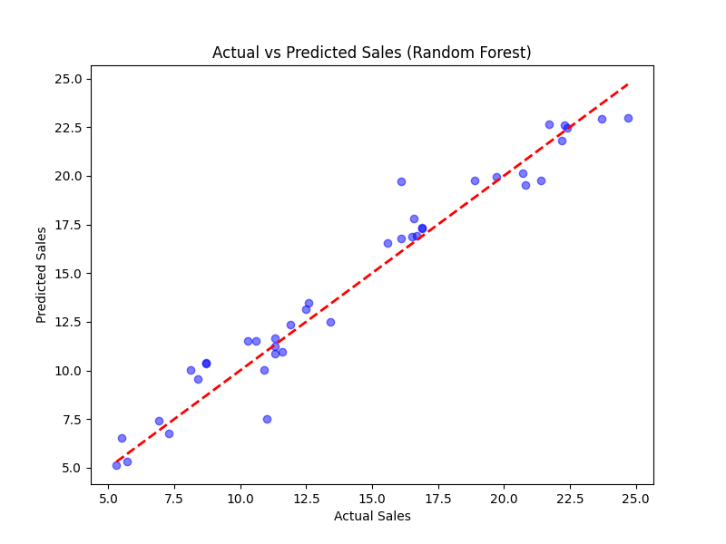
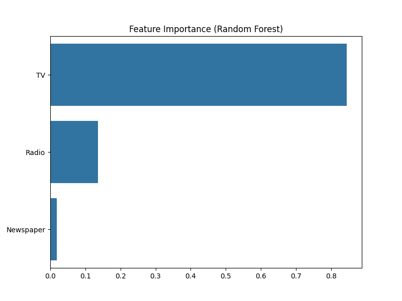

# Sales Prediction using Python and Machine Learning

## Project Overview
This project develops a regression-based machine learning model to predict product sales based on advertising spend across different channels (TV, Radio, Newspaper). The goal is to help businesses forecast sales and optimize advertising budgets.

## Dataset
- **Source**: [Advertising Dataset](https://www.kaggle.com/datasets/ashydv/advertising-dataset)
- **Features**: TV, Radio, Newspaper (advertising spend in $)
- **Target**: Sales (in units)
- **Size**: 200 samples

## Folder Structure
- `data/`: Contains the raw dataset (`advertising.csv`)
- `notebooks/`: Jupyter notebooks for exploratory data analysis (EDA)
- `src/`: Python scripts for data preprocessing, model training, and evaluation
- `images/`: Visualizations (e.g., pairplots, feature importance)
- `models/`: Trained models (`linear_regression.pkl`, `random_forest.pkl`)
- `main.py`: Main script to run the entire pipeline
- `requirements.txt`: List of dependencies

License
MIT License

Contact
GitHub: Vidula-Hub
Email: [vidulasri.s.s@gmail.com]

Take screenshots or drag-and-drop the images into README.md to display them:

  